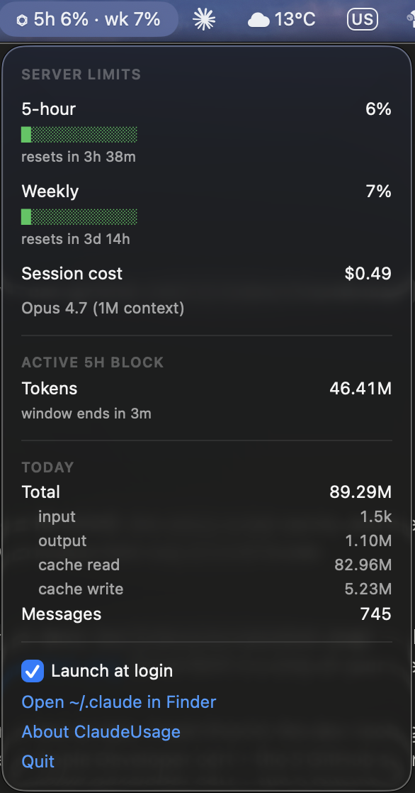

# ClaudeUsage

A small macOS menu bar app showing Claude Code session and weekly usage at a glance.

<!-- Screenshot lives in docs/screenshot.png. Replace with a real capture before sharing widely. -->


## Why

- **Zero network.** No analytics, no update checks, no telemetry. The entitlements file omits every `com.apple.security.network.*` key — there is no way for the app to reach the internet.
- **Sandboxed in shipped builds.** Read-only access to `~/.claude/` only.
- **Short source.** Under 700 lines of Swift. A stranger can read the whole thing in 15 minutes.

## Build and run

```sh
git clone https://github.com/raresmun/claudeusage
cd claudeusage
./scripts/setup-statusline.sh      # one-time: wire Claude Code's statusline up
./scripts/build.sh                 # produces an unsigned .app
open build/DerivedData/Build/Products/Release/ClaudeUsage.app
```

Requirements: macOS 13 Ventura or later, and Xcode 15+ on the build machine.

## Setup

Claude Code does **not** write any rate-limit data to disk on its own. The numbers ClaudeUsage shows for the 5-hour and weekly limits come from JSON that Claude Code pipes to its statusline command on every prompt. To make that data available to a separate app, `scripts/setup-statusline.sh` adds one line to `~/.claude/statusline.sh` that persists the JSON to `~/.claude/statusline.jsonl`. It's idempotent and makes a timestamped backup before editing. If you have no custom statusline yet, the script prints instructions for setting one up first.

Without this step, the menu bar will show `⏣ —` for percentages but will still show today's tokens and the active 5-hour block tokens from `~/.claude/projects/`.

## How it works

ClaudeUsage reads two paths under `~/.claude/`, both read-only:

- **`~/.claude/statusline.jsonl`** — written by your statusline command (after running `scripts/setup-statusline.sh`). ClaudeUsage tail-reads the last valid JSON line to pull out `rate_limits.five_hour.used_percentage`, `rate_limits.seven_day.used_percentage`, their `resets_at` timestamps, `cost.total_cost_usd`, and `model.display_name`.
- **`~/.claude/projects/**/*.jsonl`** — one file per Claude Code session. ClaudeUsage walks these, filtered by recent modification time, to sum tokens for today's totals and the active 5-hour block. The 5-hour block uses the server-provided `resets_at` timestamp to determine the exact block boundary (`resets_at − 5h`), so the token count matches what Claude Code reports internally rather than using a rolling window.

The app refreshes every 30 seconds, and again the moment you open the dropdown. It pauses the timer during system sleep and resumes on wake.

## Privacy

The trust story:

- The entitlements file ([`ClaudeUsage/ClaudeUsage.entitlements`](ClaudeUsage/ClaudeUsage.entitlements)) declares the sandbox and a read-only temporary exception for `~/.claude/`. No `com.apple.security.network.*` keys.
- The source is small enough to audit ([`ClaudeUsage/`](ClaudeUsage/)).

Caveats worth knowing about:

- A **locally-built** `./scripts/build.sh` artifact is ad-hoc signed and runs unsandboxed — Apple won't honor the temporary-exception entitlement without a Developer ID. The privacy claim above is about the **notarized release build** (when one exists). The source you ran is the same; the sandbox is just absent locally.
- The setup script modifies one file under `~/.claude/`. That's it. No other writes.

## Status

This is v0.1 and a few things from the original plan are still pending:

- **No notarized DMG release yet.** The `.github/workflows/release.yml` pipeline is wired up but has never been exercised end-to-end — it requires an Apple Developer cert and five GitHub secrets (see `CLAUDE.md`).
- **No Homebrew cask yet.**
- **No app icon yet.** The Assets catalog is wired up but contains no PNGs.
- **RAM is ~90 MB**, not the <30 MB target in the brief. SwiftUI `MenuBarExtra` carries significant overhead; hitting that target would mean rewriting against `NSStatusItem`.
- **Tested only on macOS 26 (Apple Silicon).** The minimum is macOS 13 Ventura but I haven't verified the menu bar label color rendering there.

## Roadmap

- Notification when approaching a rate limit
- Per-project token breakdown
- The Status items above

## License

MIT — see [LICENSE](LICENSE).
